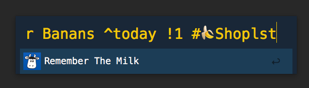

Remember The Milk ❤️ Alfred
========

This Alfred-plugin requires the [command-line interface (CLI)](https://www.npmjs.com/package/rtm-cli) for [Remember The
Milk](https://www.rememberthemilk.com/). 




## Install the RTM CLI app

If you already have [Node](https://nodejs.org) installed, this program can be
installed via `npm`:

```shell
npm install -g rtm-cli
```
which will install the executable `rtm` into your `$PATH`.

**Note:** RTM CLI requires Node version >= 7.5.0

Authenticate the RTM CLI against the Remember The Milk API. This will create a file called  `~/.rtm.json`, containing your apiKey and apiSecret:

    rtm ls
    
For full documentation on the usage of the rtm-cli app see the [RTM CLI Command Reference](https://github.com/dwaring87/rtm-cli/wiki/Command-Reference).


## Install the Alfred plugin:

Download the Alfred-plugin from this repo and install it by opening the file :-) 

Now you can add tasks with **r** in Alfred. Support for **Smart Add**  😎
[Learn more about Smart Add in Remember The Milk](https://www.rememberthemilk.com/help/answer/basics-smartadd-howdoiuse).

Example:

    r Remember the to Buy milk ^today !1 #🍌 Shoppinglist
